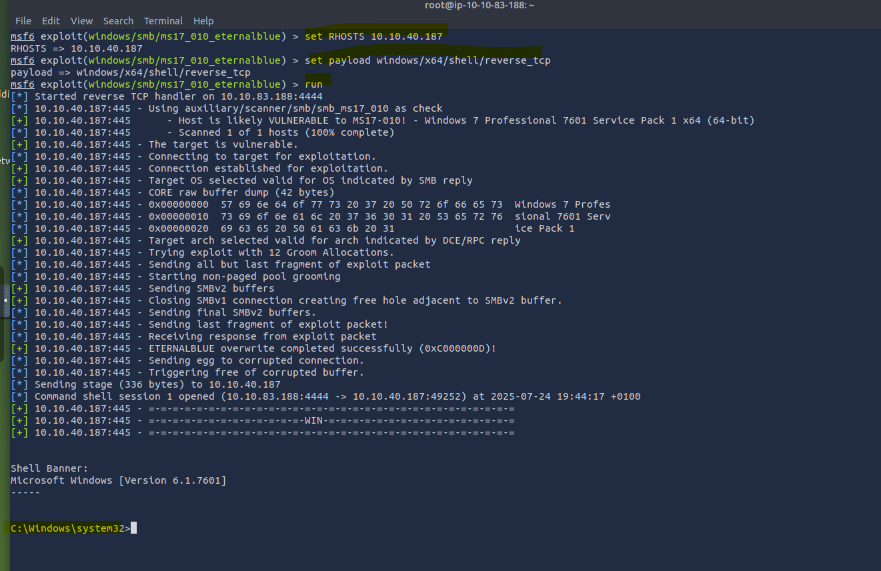
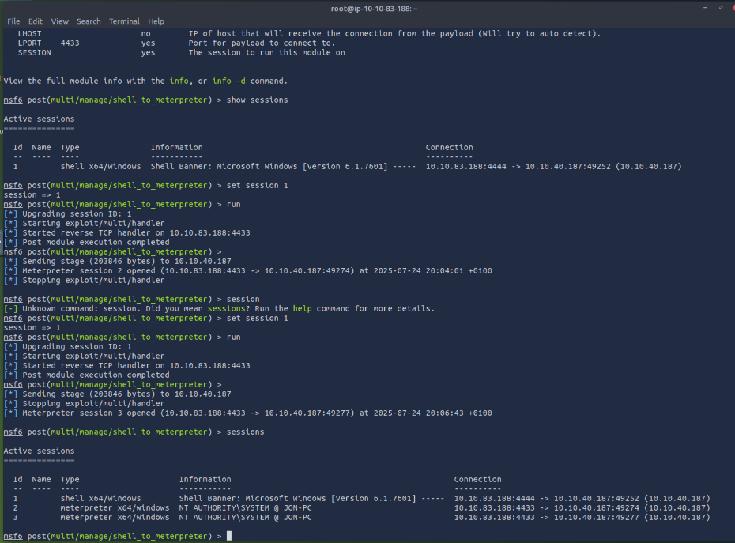
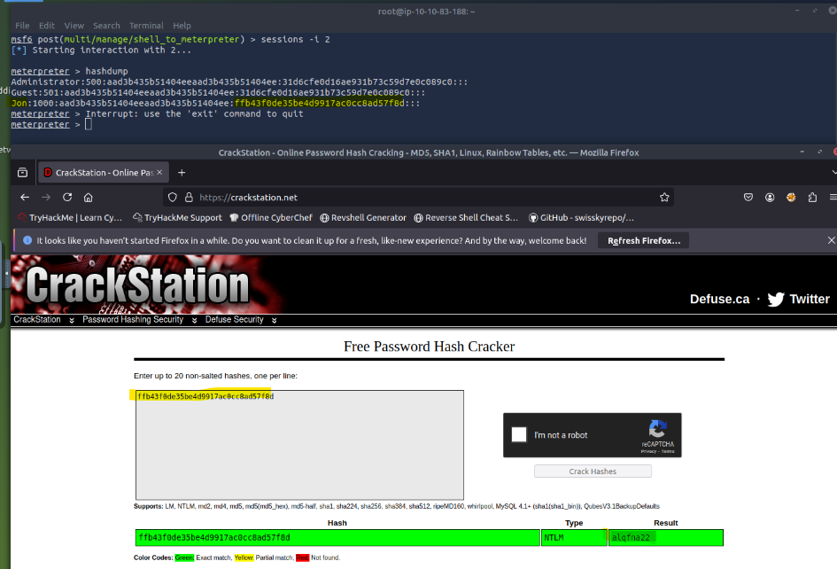
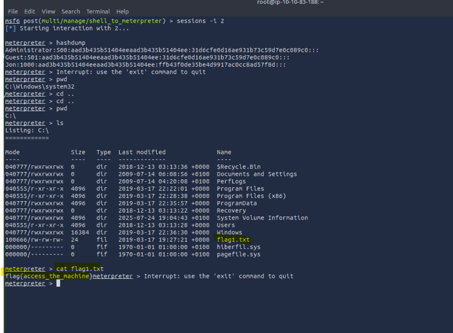

# Exploitando MS17-010 (EternalBlue) con Metasploit

Práctica realizada en el laboratorio de TryHackMe como parte del curso "Cybersecurity 101".

## 📌 CVE utilizado
- [CVE-2017-0144](https://nvd.nist.gov/vuln/detail/CVE-2017-0144)

## 🛠️ Herramientas utilizadas
- Maquina de TryHackMe
- Metasploit Framework
- Módulo: `exploit/windows/smb/ms17_010_eternalblue`

## 🧪 Objetivo
Acceder a una máquina vulnerable a través del módulo de EternalBlue y obtener una shell con permisos elevados.

## 📸 Capturas

crakeo_hash.png
## 📝 Pasos resumidos
1. `msfconsole`
2. `search ms17_010`
3. `use exploit/windows/smb/ms17_010_eternalblue`
4. Configuración del payload
5. Obtención de shell y extracción de hashes

## 📄 Detalles completos
👉 Ver el documento: [exploit_steps.md](exploit_steps.md)

## 🔗 Recursos
- [Notion con explicación completa](https://www.notion.so/APUNTES-Cybersecurity-101-Metasploit-TryHackMe-23-7-2025-239fce23a6aa80a693e1c668dcc47a57)
- [TryHackMe Room](https://tryhackme.com/room/metasploit)

---

# 🎯 Conclusión

✔️ Aprendí a usar Metasploit para explotación remota.  
✔️ Logré escalar de shell básica a una sesión de Meterpreter.  
✔️ Accedí a credenciales y archivos sensibles.  
✔️ Refuerzo la importancia de parchear servicios SMB desactualizados.

> 🔐 **NOTA:** Esta práctica fue realizada en un entorno cerrado, controlado y legal, exclusivamente con fines educativos. No se debe replicar en sistemas reales sin autorización expresa.
